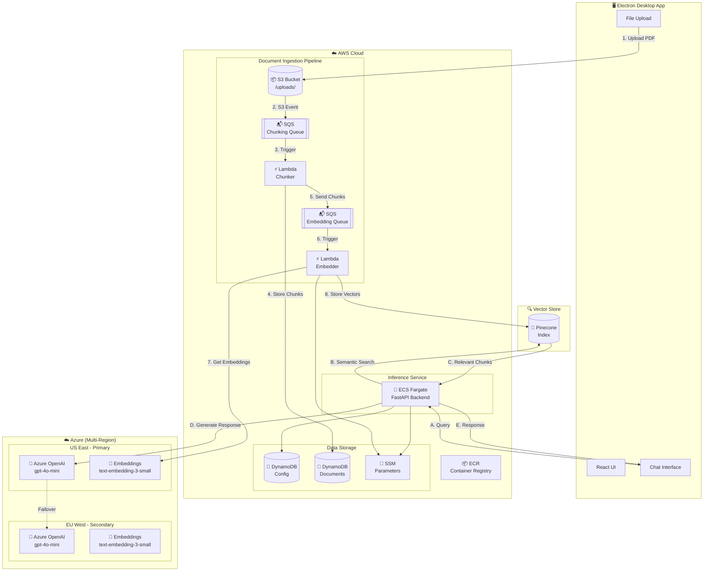

# RAG Pipeline Architecture Diagram

## How to View in AWS Application Composer

1. **Open AWS Console** → Search for "Application Composer"
2. **Click "Create project"** → Select "Load existing project"
3. **Upload** the `template.yaml` file from `infrastructure/application-composer/`
4. **View** your visual architecture diagram!

---

## Architecture Overview

```
┌─────────────────────────────────────────────────────────────────────────────────────────┐
│                              RAG PIPELINE ARCHITECTURE                                   │
│                              Developer Week Demo                                         │
└─────────────────────────────────────────────────────────────────────────────────────────┘

┌──────────────────────────────────────────────────────────────────────────────────────────┐
│  CLIENT LAYER                                                                            │
│  ┌─────────────────┐                                                                     │
│  │   Electron UI   │  ← Desktop App (Upload Documents + Chat Interface)                 │
│  │   (React/Vue)   │                                                                     │
│  └────────┬────────┘                                                                     │
│           │ HTTPS                                                                        │
└───────────┼──────────────────────────────────────────────────────────────────────────────┘
            │
            ▼
┌──────────────────────────────────────────────────────────────────────────────────────────┐
│  AWS CLOUD                                                                               │
│                                                                                          │
│  ┌─────────────────────────────────────────────────────────────────────────────────────┐ │
│  │  INFERENCE SERVICE (ECS Fargate)                                                    │ │
│  │  ┌─────────────────────────────────────────────────────────────────────────────┐   │ │
│  │  │  FastAPI Backend                                                             │   │ │
│  │  │  ┌─────────────┐  ┌──────────────┐  ┌─────────────────────────────────────┐ │   │ │
│  │  │  │  /upload    │  │  /query      │  │  Azure OpenAI Client                │ │   │ │
│  │  │  │  endpoint   │  │  endpoint    │  │  (Multi-Region Failover)            │ │   │ │
│  │  │  └──────┬──────┘  └──────┬───────┘  │  ┌───────┐  ┌───────┐              │ │   │ │
│  │  │         │                │          │  │US-East│→ │EU-West│  (Failover)  │ │   │ │
│  │  │         │                │          │  │Primary│  │Backup │              │ │   │ │
│  │  │         │                │          │  └───────┘  └───────┘              │ │   │ │
│  │  └─────────┼────────────────┼──────────┴─────────────────────────────────────┘   │ │
│  └────────────┼────────────────┼────────────────────────────────────────────────────┘ │
│               │                │                                                       │
│               ▼                ▼                                                       │
│  ┌────────────────────┐   ┌──────────────────────────────────────────────────────────┐ │
│  │                    │   │  VECTOR STORE                                            │ │
│  │    S3 Bucket       │   │  ┌─────────────┐                                         │ │
│  │  ┌─────────────┐   │   │  │  Pinecone   │  ← Semantic Search                      │ │
│  │  │  /uploads/  │   │   │  │  Index      │                                         │ │
│  │  │   (PDFs,    │   │   │  └─────────────┘                                         │ │
│  │  │    TXTs)    │   │   └──────────────────────────────────────────────────────────┘ │
│  │  └──────┬──────┘   │                                                                │
│  └─────────┼──────────┘                                                                │
│            │                                                                           │
│            │ S3 Event Notification                                                     │
│            ▼                                                                           │
│  ┌─────────────────────────────────────────────────────────────────────────────────────┐ │
│  │  DOCUMENT INGESTION PIPELINE                                                        │ │
│  │                                                                                     │ │
│  │  ┌─────────────┐    ┌─────────────────┐    ┌─────────────┐    ┌─────────────────┐  │ │
│  │  │  SQS Queue  │    │  Lambda:        │    │  SQS Queue  │    │  Lambda:        │  │ │
│  │  │  (Chunking) │───▶│  Chunker        │───▶│ (Embedding) │───▶│  Embedder       │  │ │
│  │  │             │    │                 │    │             │    │                 │  │ │
│  │  │  ┌───────┐  │    │  • PyPDFLoader  │    │  ┌───────┐  │    │  • Azure OpenAI │  │ │
│  │  │  │  DLQ  │  │    │  • TextSplitter │    │  │  DLQ  │  │    │  • Embedding    │  │ │
│  │  │  └───────┘  │    │  • tiktoken     │    │  └───────┘  │    │  • Pinecone     │  │ │
│  │  └─────────────┘    └────────┬────────┘    └─────────────┘    └────────┬────────┘  │ │
│  │                              │                                         │           │ │
│  └──────────────────────────────┼─────────────────────────────────────────┼───────────┘ │
│                                 │                                         │             │
│                                 ▼                                         ▼             │
│  ┌─────────────────────────────────────────────────────────────────────────────────────┐ │
│  │  DATA STORAGE                                                                       │ │
│  │  ┌─────────────────────────┐    ┌─────────────────────────┐                         │ │
│  │  │  DynamoDB: Config       │    │  DynamoDB: Documents    │                         │ │
│  │  │  • Azure endpoints      │    │  • Document metadata    │                         │ │
│  │  │  • API keys (refs)      │    │  • Chunk info           │                         │ │
│  │  │  • Region priorities    │    │  • Processing status    │                         │ │
│  │  └─────────────────────────┘    └─────────────────────────┘                         │ │
│  │                                                                                     │ │
│  │  ┌─────────────────────────┐                                                        │ │
│  │  │  SSM Parameter Store    │  ← Secure credential storage                          │ │
│  │  │  • Azure API Keys       │                                                        │ │
│  │  │  • Pinecone API Key     │                                                        │ │
│  │  └─────────────────────────┘                                                        │ │
│  └─────────────────────────────────────────────────────────────────────────────────────┘ │
│                                                                                          │
└──────────────────────────────────────────────────────────────────────────────────────────┘
                                         │
                                         │ HTTPS (Failover)
                                         ▼
┌──────────────────────────────────────────────────────────────────────────────────────────┐
│  AZURE CLOUD (Multi-Region)                                                              │
│                                                                                          │
│  ┌────────────────────────────────┐    ┌────────────────────────────────┐               │
│  │  US East (Primary)             │    │  EU West (Secondary)           │               │
│  │  ┌──────────────────────────┐  │    │  ┌──────────────────────────┐  │               │
│  │  │  Azure OpenAI Service    │  │    │  │  Azure OpenAI Service    │  │               │
│  │  │  ├─ gpt-4o-mini (Chat)   │  │    │  │  ├─ gpt-4o-mini (Chat)   │  │               │
│  │  │  └─ text-embedding-3     │  │    │  │  └─ text-embedding-3     │  │               │
│  │  │      -small (Embed)      │  │    │  │      -small (Embed)      │  │               │
│  │  └──────────────────────────┘  │    │  └──────────────────────────┘  │               │
│  └────────────────────────────────┘    └────────────────────────────────┘               │
│                                                                                          │
│              Primary Request ─────────────────▶ Failover if unavailable                 │
│                                                                                          │
└──────────────────────────────────────────────────────────────────────────────────────────┘
```

---

## Data Flow Diagram



---

## Failover Architecture

```
                    ┌─────────────────────────────────────────────────────────────┐
                    │                    FAILOVER LOGIC                           │
                    └─────────────────────────────────────────────────────────────┘
                    
                              ┌─────────────────┐
                              │   ECS/Lambda    │
                              │   Application   │
                              └────────┬────────┘
                                       │
                                       ▼
                              ┌─────────────────┐
                              │  Try Primary    │
                              │  (US East)      │
                              └────────┬────────┘
                                       │
                          ┌────────────┴────────────┐
                          │                         │
                          ▼                         ▼
                    ┌───────────┐            ┌───────────┐
                    │  Success  │            │  Failure  │
                    │  (200 OK) │            │ (Timeout/ │
                    └─────┬─────┘            │   Error)  │
                          │                  └─────┬─────┘
                          │                        │
                          ▼                        ▼
                    ┌───────────┐            ┌───────────┐
                    │  Return   │            │ Try       │
                    │  Response │            │ Secondary │
                    └───────────┘            │ (EU West) │
                                             └─────┬─────┘
                                                   │
                                      ┌────────────┴────────────┐
                                      │                         │
                                      ▼                         ▼
                                ┌───────────┐            ┌───────────┐
                                │  Success  │            │  Failure  │
                                └─────┬─────┘            └─────┬─────┘
                                      │                        │
                                      ▼                        ▼
                                ┌───────────┐            ┌───────────┐
                                │  Return   │            │  Return   │
                                │  Response │            │  Error    │
                                └───────────┘            └───────────┘
```

---

## Component Details

| Component | AWS Service | Purpose |
|-----------|-------------|---------|
| Document Storage | S3 | Store uploaded PDFs/TXTs |
| Chunking Queue | SQS | Buffer for chunking Lambda |
| Chunker | Lambda | Split documents into chunks |
| Embedding Queue | SQS | Buffer for embedding Lambda |
| Embedder | Lambda | Generate embeddings via Azure OpenAI |
| Vector Store | Pinecone | Store and search embeddings |
| Backend API | ECS Fargate | FastAPI inference service |
| Config Store | DynamoDB | Azure OpenAI endpoints/config |
| Secrets | SSM Parameter Store | API keys (encrypted) |
| Container Registry | ECR | Docker images for ECS |

---

## CI/CD Pipeline

```
┌──────────────┐     ┌──────────────┐     ┌──────────────┐     ┌──────────────┐
│   GitHub     │────▶│   GitHub     │────▶│   Build &    │────▶│   Deploy     │
│   Push       │     │   Actions    │     │   Test       │     │   to AWS     │
└──────────────┘     └──────────────┘     └──────────────┘     └──────────────┘
                                                │
                           ┌────────────────────┼────────────────────┐
                           │                    │                    │
                           ▼                    ▼                    ▼
                     ┌───────────┐        ┌───────────┐        ┌───────────┐
                     │  Lambda   │        │   ECR     │        │ Terraform │
                     │  Deploy   │        │   Push    │        │   Apply   │
                     └───────────┘        └───────────┘        └───────────┘
```
