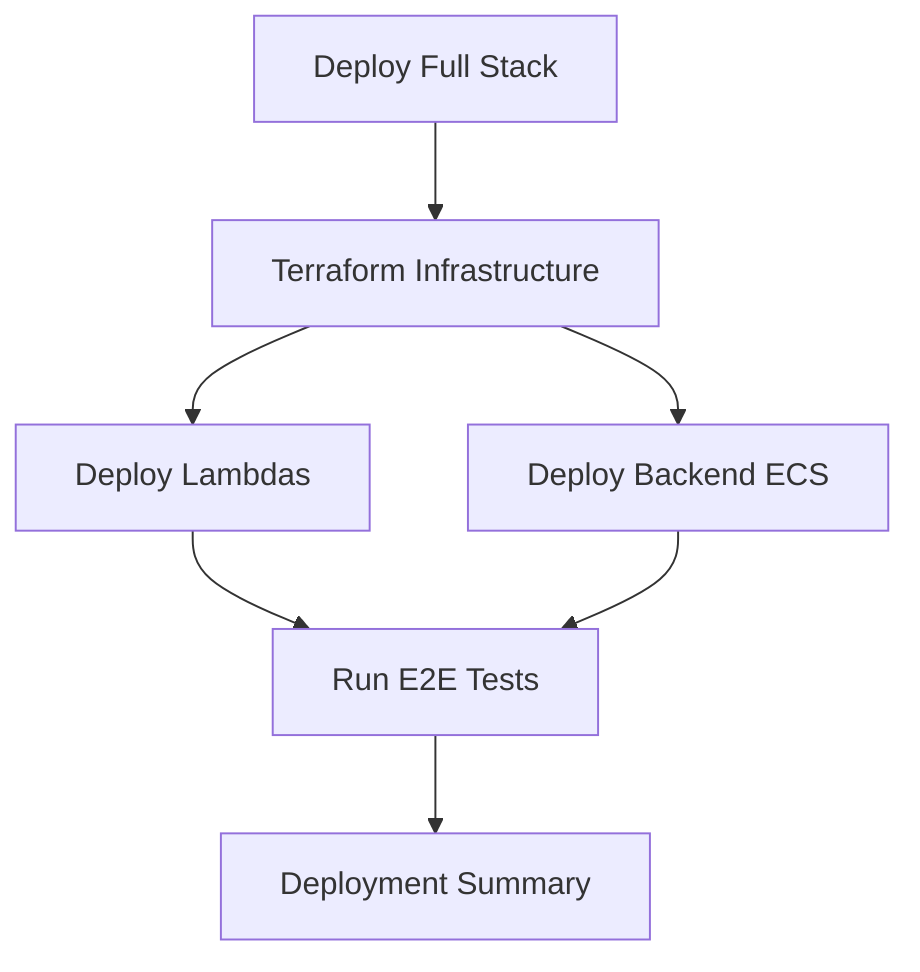

# CI/CD and Deployment - Complete Guide

## 🎯 Overview

This project includes a complete CI/CD pipeline using **GitHub Actions** and **Terraform Cloud** to deploy a production-ready RAG application to AWS.

## 📁 Key Files Added/Modified

### GitHub Actions Workflows (`.github/workflows/`)
- ✅ `infrastructure.yml` - Terraform infrastructure deployment (updated to be reusable)
- ✅ `deploy-ecs.yml` - ECS backend deployment  
- ✅ `deploy-lambda.yml` - Lambda functions deployment
- ✅ `e2e-tests.yml` - **NEW** End-to-end testing workflow
- ✅ `deploy-full-stack.yml` - **NEW** Master orchestration workflow

### Testing
- ✅ `backend/tests/test_e2e.py` - **NEW** Comprehensive E2E tests
- ✅ `backend/pytest.ini` - **NEW** Pytest configuration
- ✅ `backend/requirements.txt` - Updated with pytest dependencies

### Configuration
- ✅ `.env.example` - **NEW** Environment variables template
- ✅ `infrastructure/terraform/providers.tf` - Fixed organization name (removed space)

### Scripts
- ✅ `scripts/setup-github-actions.ps1` - **NEW** Quick setup script
- ✅ `scripts/setup-ssm-parameters.ps1` - **NEW** AWS SSM configuration helper

### Documentation
- ✅ `docs/GITHUB-ACTIONS-SETUP.md` - **NEW** Complete setup guide
- ✅ `docs/DEPLOYMENT-CHECKLIST.md` - **NEW** Pre-deployment checklist
- ✅ `docs/CI-CD-SUMMARY.md` - **NEW** This file

## 🚀 Quick Start

### 1. One-Time Setup (5-10 minutes)

```powershell
# Run the automated setup script
./scripts/setup-github-actions.ps1
```

This script will:
- ✅ Check prerequisites (AWS CLI, Terraform, Python)
- ✅ Create `.env` from template
- ✅ Get AWS account information
- ✅ Update Terraform variables
- ✅ Install Python dependencies
- ✅ Display next steps

### 2. Configure Secrets

#### GitHub Secrets
Go to: `Settings > Secrets and variables > Actions`

Add these secrets:
```
AWS_ACCESS_KEY_ID
AWS_SECRET_ACCESS_KEY
TF_API_TOKEN
```

#### Terraform Cloud
1. Create account at https://app.terraform.io
2. Create organization: `agentic-ai-org`
3. Create workspace: `agentic-ai-rag-workspace`
4. Add environment variables:
   - `AWS_ACCESS_KEY_ID` (sensitive)
   - `AWS_SECRET_ACCESS_KEY` (sensitive)

#### AWS SSM Parameters
```powershell
# Run the SSM setup script
./scripts/setup-ssm-parameters.ps1
```

### 3. Deploy Everything

#### Option A: GitHub Actions (Recommended)
1. Go to `Actions` → `Deploy Full Stack`
2. Click `Run workflow`
3. Configure:
   - Environment: `dev`
   - Terraform action: `apply`
   - All checkboxes: ✅
4. Click `Run workflow`

#### Option B: Manual Deployment
```bash
# 1. Deploy infrastructure
cd infrastructure/terraform
terraform init
terraform plan -var-file=environments/dev.tfvars
terraform apply -var-file=environments/dev.tfvars

# 2. Deploy backend
cd ../../backend
# Build and push Docker image to ECR
# Deploy to ECS

# 3. Deploy Lambdas
cd ../lambda/chunker
# Package and deploy

cd ../embedder
# Package and deploy
```

## 🧪 Testing Strategy

### Test Levels

1. **Unit Tests** (`test_api.py`)
   - Fast, no external dependencies
   - Run on every PR
   
2. **Integration Tests** (`test_e2e.py::TestHealthEndpoints`)
   - Tests API endpoints locally
   - Run on every PR

3. **AWS Integration Tests** (`test_e2e.py::TestAWSIntegration`)
   - Tests AWS service connectivity
   - Requires AWS credentials
   - Run manually or on workflow_dispatch

4. **E2E Tests** (`test_e2e.py::TestEndToEndFlow`)
   - Tests complete flow: upload → chunk → embed → query
   - Requires full deployment
   - Run after deployment

### Running Tests Locally

```bash
cd backend

# Unit tests only
pytest tests/test_api.py -v

# Integration tests
pytest tests/test_e2e.py::TestHealthEndpoints -v

# AWS integration tests (requires AWS credentials)
export RUN_AWS_TESTS=1
pytest tests/test_e2e.py::TestAWSIntegration -v

# Full E2E tests (requires deployment)
export RUN_E2E_TESTS=1
export RUN_AWS_TESTS=1
pytest tests/test_e2e.py -v
```

### Running Tests via GitHub Actions

Go to `Actions` → `E2E Tests` → `Run workflow`

Options:
- **Environment**: `dev` / `staging` / `prod`
- **Run AWS tests**: Enable to test AWS integration

## 📊 Deployment Workflows

### Workflow Hierarchy

```
deploy-full-stack.yml (Master Orchestrator)
  ├── infrastructure.yml (Terraform)
  ├── deploy-lambdas (Chunker + Embedder)
  ├── deploy-backend (ECS)
  └── e2e-tests.yml (Validation)
```

### Individual Workflows

| Workflow | Trigger | Purpose |
|----------|---------|---------|
| `infrastructure.yml` | Manual / PR | Deploy AWS infrastructure via Terraform |
| `deploy-ecs.yml` | Push to `backend/**` | Deploy FastAPI backend to ECS |
| `deploy-lambda.yml` | Push to `lambda/**` | Deploy Lambda functions |
| `e2e-tests.yml` | PR / Manual | Run comprehensive tests |
| `deploy-full-stack.yml` | Manual only | Deploy entire stack |

### Deployment Flow



## 🔧 Infrastructure Components

### AWS Resources Created

| Service | Resource | Purpose |
|---------|----------|---------|
| **S3** | `rag-demo-documents-{account}` | Document storage |
| **SQS** | `rag-demo-document-chunking` | S3 → Chunker trigger |
| **SQS** | `rag-demo-document-embedding` | Chunker → Embedder queue |
| **Lambda** | `rag-demo-chunker` | Document chunking function |
| **Lambda** | `rag-demo-embedder` | Embedding generation function |
| **DynamoDB** | `rag-demo-config` | Configuration storage |
| **DynamoDB** | `rag-demo-documents` | Document metadata |
| **ECR** | `rag-demo-backend` | Docker image registry |
| **ECS** | `rag-demo` cluster | Container orchestration |
| **ECS** | `backend` service | FastAPI application |
| **SSM** | `/rag-demo/azure-openai/*` | Azure OpenAI secrets |
| **IAM** | Multiple roles | Service permissions |
| **CloudWatch** | Log groups | Application logs |

### Data Flow

```
1. Upload Document
   └─> FastAPI Backend

2. Store in S3
   └─> s3://rag-demo-documents/uploads/

3. S3 Event → SQS
   └─> rag-demo-document-chunking queue

4. Chunker Lambda
   ├─> Read from S3
   ├─> Chunk document
   ├─> Store metadata in DynamoDB
   └─> Send chunks to SQS

5. Embedding Queue
   └─> rag-demo-document-embedding queue

6. Embedder Lambda
   ├─> Read chunk from SQS
   ├─> Generate embedding (Azure OpenAI)
   ├─> Store in vector DB (Chroma/Pinecone)
   └─> Update DynamoDB

7. Query
   ├─> FastAPI receives query
   ├─> Search vector DB
   ├─> Retrieve relevant chunks
   └─> Generate response (Azure OpenAI)
```

## 🔒 Security Best Practices

✅ **Implemented**:
- All secrets in AWS SSM Parameter Store or GitHub Secrets
- No hardcoded credentials
- S3 bucket encryption enabled
- DynamoDB encryption enabled
- Secure string type for SSM API keys
- IAM roles with least privilege
- Security groups restrict access

🔄 **Recommended for Production**:
- Enable MFA for AWS accounts
- Rotate credentials regularly
- Enable AWS CloudTrail
- Configure WAF rules
- Set up VPC endpoints
- Enable GuardDuty

## 💰 Cost Estimation

### Development Environment (24/7)

| Service | Cost/Month |
|---------|------------|
| ECS Fargate (1 task, 0.5 vCPU, 1GB) | ~$15 |
| Lambda (100k invocations/month) | ~$1 |
| S3 (10GB storage, 1000 requests) | ~$0.50 |
| SQS (100k requests) | ~$0.05 |
| DynamoDB (on-demand, light usage) | ~$1 |
| CloudWatch Logs (1GB) | ~$0.50 |
| **Total** | **~$18/month** |

### Production Environment (24/7 with autoscaling)

| Service | Cost/Month |
|---------|------------|
| ECS Fargate (2-4 tasks) | ~$50-100 |
| Lambda (1M invocations/month) | ~$5 |
| S3 (100GB storage) | ~$3 |
| SQS | ~$0.50 |
| DynamoDB | ~$5-20 |
| CloudWatch | ~$5 |
| Data Transfer | ~$10 |
| **Total** | **~$80-150/month** |

**Azure OpenAI Costs** (additional):
- GPT-4o-mini: ~$0.15-0.60 per 1M tokens
- Embeddings: ~$0.10 per 1M tokens

## 📚 Documentation Structure

```
docs/
├── 00-overview.md                 # Project overview
├── GITHUB-ACTIONS-SETUP.md       # ⭐ Complete setup guide
├── DEPLOYMENT-CHECKLIST.md       # ⭐ Pre-deployment checklist
├── CI-CD-SUMMARY.md             # ⭐ This file
├── ARCHITECTURE.md               # Architecture details
└── architecture/                 # Architecture diagrams
```

## 🐛 Troubleshooting

### Common Issues

#### 1. Terraform Cloud Authentication Failed
```
Error: Invalid credentials
```
**Solution**: 
- Verify `TF_API_TOKEN` in GitHub Secrets
- Check organization name in `providers.tf`
- Ensure workspace exists

#### 2. ECS Task Fails to Start
```
Error: Task stopped with exit code 1
```
**Solution**:
- Check CloudWatch logs: `/ecs/rag-demo`
- Verify SSM parameters exist and are accessible
- Check IAM task role permissions
- Verify environment variables in task definition

#### 3. Lambda Deployment Fails
```
Error: Package size too large
```
**Solution**:
- Use Lambda layers for large dependencies
- Optimize package size
- Consider using container images for Lambda

#### 4. Tests Fail: "Service not ready"
```
Error: Service not responding
```
**Solution**:
- Wait for ECS service to stabilize (can take 2-5 minutes)
- Check security group allows port 8000
- Verify health check endpoint is accessible

### Debug Commands

```bash
# Check ECS service status
aws ecs describe-services --cluster rag-demo --services backend

# View ECS logs
aws logs tail /ecs/rag-demo --follow

# Check Lambda function
aws lambda get-function --function-name rag-demo-chunker

# View Lambda logs
aws logs tail /aws/lambda/rag-demo-chunker --follow

# List SSM parameters
aws ssm describe-parameters --query "Parameters[?contains(Name, 'rag-demo')]"

# Test API endpoint
curl http://<ecs-ip>:8000/health
```

## 🎯 Next Steps

1. ✅ **Complete Setup** - Follow `GITHUB-ACTIONS-SETUP.md`
2. ✅ **Run Deployment** - Use `Deploy Full Stack` workflow
3. ✅ **Test Application** - Upload documents and query
4. ✅ **Monitor Costs** - Set up AWS Budget alerts
5. ✅ **Production Planning** - Review `DEPLOYMENT-CHECKLIST.md`

## 📞 Support

- **Setup Issues**: See `docs/GITHUB-ACTIONS-SETUP.md`
- **Deployment Issues**: See `docs/DEPLOYMENT-CHECKLIST.md`
- **Architecture Questions**: See `docs/ARCHITECTURE.md`
- **Cost Questions**: See `docs/cost-estimation.md`

## ✅ What's Complete

- ✅ Terraform infrastructure code
- ✅ GitHub Actions workflows (all 6 workflows)
- ✅ Comprehensive E2E tests
- ✅ Setup automation scripts
- ✅ Complete documentation
- ✅ Environment configuration
- ✅ Security best practices
- ✅ Cost optimization

## 🚀 Ready to Deploy!

Your CI/CD pipeline is fully configured. Follow these steps:

1. Run `./scripts/setup-github-actions.ps1`
2. Configure GitHub Secrets
3. Set up Terraform Cloud
4. Add Azure credentials to AWS SSM
5. Deploy via GitHub Actions!

**Good luck with your deployment! 🎉**

