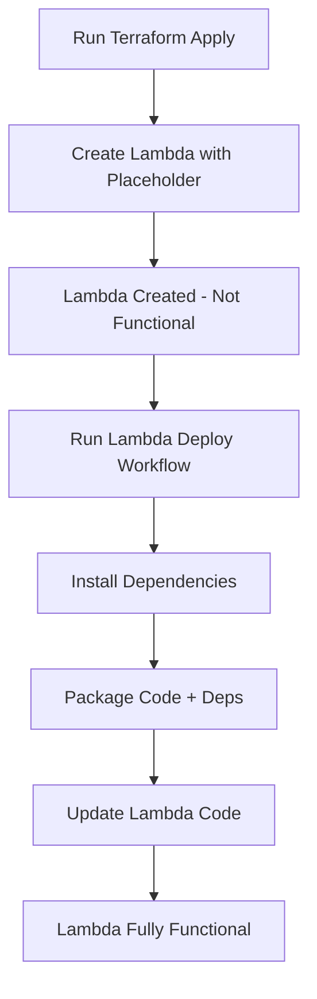
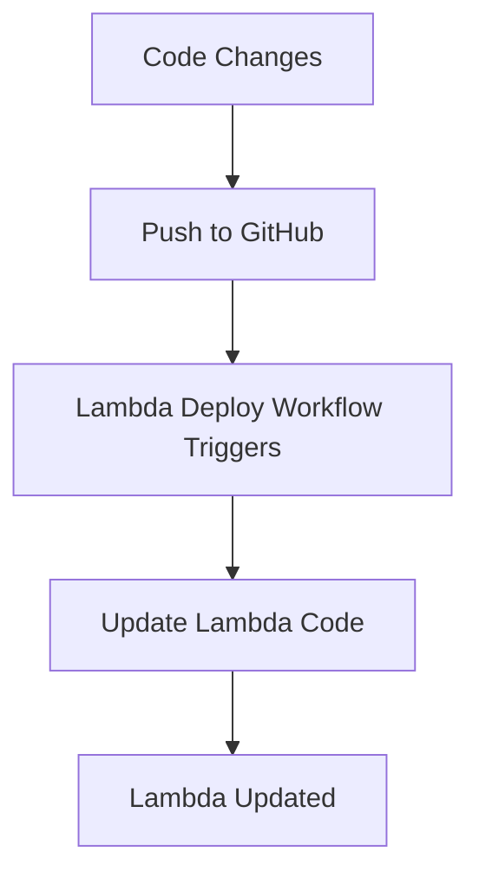

# Lambda Deployment Strategy

## 📋 Overview

The Lambda functions use a **two-stage deployment approach** to handle large Python dependencies efficiently.

## 🏗️ Architecture

### Stage 1: Infrastructure Provisioning (Terraform)
Terraform creates the Lambda function resources with **placeholder code**:
- Creates Lambda function with minimal handler
- Sets up IAM roles and permissions
- Configures environment variables
- Sets up SQS triggers
- Creates CloudWatch log groups

### Stage 2: Code Deployment (GitHub Actions)
GitHub Actions deploys the actual code with dependencies:
- Installs Python dependencies (`pip install -r requirements.txt`)
- Packages code + dependencies into ZIP
- Deploys to Lambda via `aws lambda update-function-code`

## 🔍 Why This Approach?

### Problem with Traditional Terraform Lambda Deployment
```terraform
# ❌ This doesn't work well:
data "archive_file" "lambda_code" {
  source_dir = "../../lambda/chunker"  # Missing dependencies!
}
```

**Issues**:
1. **No Dependencies**: Can't include pip packages in source_dir
2. **Large Packages**: LangChain + dependencies > 50MB
3. **Path Issues**: Relative paths break in CI/CD
4. **Slow Terraform**: Large ZIPs make terraform apply slow

### Solution: Placeholder + CI/CD Deployment
```terraform
# ✅ This works great:
data "archive_file" "lambda_code" {
  source {
    content  = "def lambda_handler(event, context): ..."
    filename = "handler.py"
  }
}

resource "aws_lambda_function" "chunker" {
  # ...
  lifecycle {
    ignore_changes = [source_code_hash]  # Updated by CI/CD
  }
}
```

**Benefits**:
1. ✅ **Fast Terraform**: Tiny placeholder ZIP
2. ✅ **Proper Dependencies**: GitHub Actions installs pip packages
3. ✅ **Separation of Concerns**: Infrastructure vs. Code deployment
4. ✅ **Reliable Paths**: No relative path issues

## 🚀 Deployment Flow

### Initial Deployment



### Subsequent Updates



## 📦 Lambda Function Structure

### Chunker Lambda
```
lambda/chunker/
├── handler.py           # Main Lambda handler
└── requirements.txt     # Python dependencies
    ├── langchain
    ├── pypdf
    ├── tiktoken
    └── boto3
```

### Embedder Lambda
```
lambda/embedder/
├── handler.py           # Main Lambda handler
└── requirements.txt     # Python dependencies
    ├── langchain
    ├── langchain-openai
    ├── chromadb
    └── boto3
```

## 🔄 Deployment Commands

### Deploy Infrastructure (Creates Placeholders)
```bash
# Via GitHub Actions
Actions → Infrastructure - Terraform → Run workflow
  Action: apply
  Environment: dev

# Via Terraform CLI
cd infrastructure/terraform
terraform apply -var-file=environments/dev.tfvars
```

### Deploy Lambda Code (Actual Functionality)
```bash
# Via GitHub Actions
Actions → Deploy Lambda Functions → Run workflow
  Function: both

# Via AWS CLI (Manual)
cd lambda/chunker
pip install -r requirements.txt -t package/
cp handler.py package/
cd package
zip -r ../chunker.zip .
aws lambda update-function-code \
  --function-name rag-demo-chunker \
  --zip-file fileb://../chunker.zip
```

## 🎯 Complete Deployment Order

### First-Time Setup
1. ✅ **Deploy Infrastructure** (Terraform)
   - Creates S3, SQS, DynamoDB, Lambda (placeholder), ECS, etc.
   
2. ✅ **Deploy Lambda Code** (GitHub Actions)
   - Updates Lambda functions with actual code
   
3. ✅ **Deploy Backend** (GitHub Actions)
   - Deploys FastAPI to ECS
   
4. ✅ **Test End-to-End**
   - Upload document → Verify processing

### Using Deploy Full Stack Workflow
```bash
# This handles everything automatically:
Actions → Deploy Full Stack → Run workflow
  Environment: dev
  Terraform action: apply
  Deploy infrastructure: ✅
  Deploy backend: ✅
  Deploy lambdas: ✅
  Run tests: ✅
```

## 🛠️ Troubleshooting

### Lambda Shows "Placeholder" Error
**Problem**: Lambda still has placeholder code

**Solution**:
```bash
# Deploy the actual Lambda code
Actions → Deploy Lambda Functions → Run workflow
```

### Lambda Package Too Large
**Problem**: Deployment package > 50MB

**Solutions**:
1. Use Lambda Layers for large dependencies
2. Remove unnecessary dependencies
3. Use Docker container images for Lambda

### Import Errors in Lambda
**Problem**: `ModuleNotFoundError: No module named 'langchain'`

**Solution**:
```bash
# Ensure dependencies are packaged
cd lambda/chunker
pip install -r requirements.txt -t package/
# Then redeploy
```

## 📊 Lambda Function Sizes

### Chunker Lambda
- **Code Only**: ~10 KB
- **With Dependencies**: ~35 MB
  - langchain: ~15 MB
  - pypdf: ~5 MB
  - tiktoken: ~10 MB
  - Other: ~5 MB

### Embedder Lambda
- **Code Only**: ~15 KB
- **With Dependencies**: ~45 MB
  - langchain: ~15 MB
  - chromadb: ~20 MB
  - langchain-openai: ~5 MB
  - Other: ~5 MB

## 🔐 Environment Variables

### Chunker Lambda
```bash
DYNAMODB_DOCUMENTS_TABLE=rag-demo-documents
EMBEDDING_QUEUE_URL=https://sqs.us-east-1.amazonaws.com/.../rag-demo-document-embedding
S3_BUCKET=rag-demo-documents-123456789012
```

### Embedder Lambda
```bash
DYNAMODB_CONFIG_TABLE=rag-demo-config
DYNAMODB_DOCUMENTS_TABLE=rag-demo-documents
USE_CHROMA=true
CHROMA_PERSIST_DIR=/tmp/chroma_db
```

## 📝 Best Practices

### ✅ Do's
- ✅ Use GitHub Actions for Lambda deployments
- ✅ Keep Terraform for infrastructure only
- ✅ Version your Lambda code in Git
- ✅ Test locally before deploying
- ✅ Monitor CloudWatch Logs after deployment

### ❌ Don'ts
- ❌ Don't package dependencies in Terraform
- ❌ Don't commit ZIP files to Git
- ❌ Don't manually update Lambda code in AWS Console
- ❌ Don't skip testing after deployment

## 🔄 Updating Lambda Code

### Automatic (Recommended)
Push changes to `lambda/**` directories triggers automatic deployment:
```bash
git add lambda/chunker/handler.py
git commit -m "Update chunker logic"
git push origin main
# GitHub Actions automatically deploys
```

### Manual
```bash
# Via workflow
Actions → Deploy Lambda Functions → Run workflow

# Via CLI
./scripts/deploy-lambda.sh chunker
```

## 📚 Related Documentation

- **GitHub Actions Setup**: `docs/GITHUB-ACTIONS-SETUP.md`
- **Deployment Checklist**: `docs/DEPLOYMENT-CHECKLIST.md`
- **CI/CD Summary**: `docs/CI-CD-SUMMARY.md`

## 🎓 Learn More

- [AWS Lambda Deployment Packages](https://docs.aws.amazon.com/lambda/latest/dg/python-package.html)
- [Terraform Lambda Best Practices](https://registry.terraform.io/providers/hashicorp/aws/latest/docs/resources/lambda_function)
- [Lambda Layers](https://docs.aws.amazon.com/lambda/latest/dg/configuration-layers.html)

---

**Summary**: Terraform creates Lambda infrastructure with placeholders. GitHub Actions deploys the actual code with dependencies. This separates infrastructure provisioning from code deployment for better reliability and speed.

