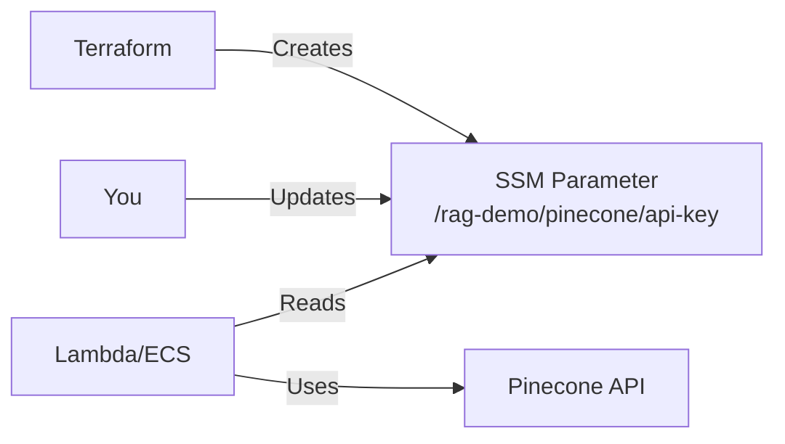

# Pinecone SSM Integration - Complete Summary

## ✅ What Changed

### Pinecone API Key Security: SSM Parameter Store (Like Azure)

Instead of storing Pinecone API key in Terraform variables or files, it's now stored in **AWS SSM Parameter Store** - the same secure pattern used for Azure OpenAI keys.

---

## 📝 Files Modified

### 1. Terraform Infrastructure

#### `infrastructure/terraform/ssm.tf`
✅ **Added** Pinecone SSM parameters:
- `/rag-demo/pinecone/api-key` (SecureString, encrypted)
- `/rag-demo/pinecone/index-name` (String)
- `/rag-demo/pinecone/environment` (String)

#### `infrastructure/terraform/variables.tf`
✅ **Removed** `pinecone_api_key` variable (no longer needed)
✅ **Kept** `pinecone_index` and `use_pinecone` flags

#### `infrastructure/terraform/lambda.tf`
✅ **Changed** embedder Lambda env vars:
```hcl
# OLD (insecure)
PINECONE_API_KEY = var.pinecone_api_key

# NEW (secure)
PINECONE_API_KEY_PARAM = aws_ssm_parameter.pinecone_api_key.name
```

#### `infrastructure/terraform/ecs.tf`
✅ **Changed** ECS backend env vars:
```hcl
# OLD (insecure)
{ name = "PINECONE_API_KEY", value = var.pinecone_api_key }

# NEW (secure)
{ name = "PINECONE_API_KEY_PARAM", value = aws_ssm_parameter.pinecone_api_key.name }
```

#### `infrastructure/terraform/terraform.tfvars.example`
✅ **Updated** to show SSM-based setup instructions

### 2. Application Code

#### `lambda/embedder/handler.py`
✅ **Added** SSM client and helper function:
```python
ssm = boto3.client('ssm')

def get_pinecone_api_key():
    """Get Pinecone API key from SSM Parameter Store"""
    param_name = os.environ.get('PINECONE_API_KEY_PARAM')
    response = ssm.get_parameter(Name=param_name, WithDecryption=True)
    return response['Parameter']['Value']
```

✅ **Updated** `store_to_pinecone()` to use SSM helper

#### `backend/app/vector_store.py`
✅ **Added** SSM client and helper function:
```python
_ssm_client = boto3.client('ssm')

def get_pinecone_api_key_from_ssm():
    """Get Pinecone API key from SSM Parameter Store"""
    param_name = os.getenv("PINECONE_API_KEY_PARAM")
    if not param_name:
        return os.getenv("PINECONE_API_KEY")  # Fallback for local dev
    
    response = _ssm_client.get_parameter(Name=param_name, WithDecryption=True)
    return response['Parameter']['Value']
```

✅ **Updated** `get_vector_store()` to use SSM helper

### 3. Documentation

#### `docs/PINECONE-SSM-SETUP.md` (NEW)
Complete setup guide for SSM-based Pinecone configuration

#### `infrastructure/terraform/pinecone-ssm.tf.example` (DELETED)
No longer needed - SSM is now the default approach

---

## 🚀 Quick Setup Guide

### Step 1: Get Pinecone API Key
```
1. Sign up: https://www.pinecone.io/
2. Create API key
3. Create index: rag-demo, 1536 dims, cosine, us-east-1
```

### Step 2: Deploy Terraform
```powershell
cd infrastructure/terraform
terraform init
terraform apply
```

This creates SSM parameter `/rag-demo/pinecone/api-key` with placeholder value.

### Step 3: Update SSM with Real Key
```powershell
aws ssm put-parameter `
  --name "/rag-demo/pinecone/api-key" `
  --value "pcsk_xxxxx_YOUR_REAL_KEY" `
  --type "SecureString" `
  --overwrite `
  --region us-east-1
```

### Step 4: Enable Pinecone (Optional)
Edit `terraform.tfvars`:
```hcl
use_pinecone = true
pinecone_index = "rag-demo"
```

Then redeploy:
```powershell
terraform apply
```

### Step 5: Verify
```powershell
# Check SSM parameter
aws ssm get-parameter --name "/rag-demo/pinecone/api-key" --with-decryption --region us-east-1

# Check Lambda env vars
aws lambda get-function-configuration --function-name rag-demo-embedder --region us-east-1
```

---

## 🔐 Security Benefits

| Aspect | Old Approach | New Approach (SSM) |
|--------|-------------|-------------------|
| **API Key Storage** | ❌ Terraform variable | ✅ AWS SSM (encrypted) |
| **Git Risk** | ❌ High (terraform.tfvars) | ✅ None (SSM only) |
| **Terraform State** | ❌ API key in state file | ✅ Only param name in state |
| **Access Control** | ❌ File-based | ✅ IAM policies |
| **Audit Trail** | ❌ None | ✅ CloudTrail logs |
| **Rotation** | ❌ Requires code change | ✅ Update SSM only |
| **Encryption** | ❌ Plaintext | ✅ KMS encrypted |
| **Pattern** | ❌ Different from Azure | ✅ Same as Azure keys |

---

## 📊 Environment Variables

### Lambda Embedder & ECS Backend
```bash
# Instead of direct API key:
PINECONE_API_KEY_PARAM=/rag-demo/pinecone/api-key  # SSM parameter name
PINECONE_INDEX=rag-demo
USE_PINECONE=true

# Code reads parameter name, then fetches actual key from SSM at runtime
```

---

## 🔄 How It Works



1. **Terraform** creates SSM parameter with placeholder
2. **You** update parameter with real API key via AWS CLI
3. **Lambda/ECS** reads parameter name from env var
4. **Code** fetches actual key from SSM at runtime
5. **Pinecone** API called with key from SSM

---

## 📚 Documentation Files

| File | Purpose |
|------|---------|
| `PINECONE-SSM-SETUP.md` | Complete SSM setup guide |
| `PINECONE-SETUP.md` | Pinecone account & index creation |
| `PINECONE-QUICK-REF.md` | Quick reference card |
| `TERRAFORM-PINECONE.md` | Terraform deployment guide |
| `terraform.tfvars.example` | Configuration template |

---

## ✅ Verification Checklist

- [x] SSM parameters created in Terraform
- [x] Lambda reads from SSM
- [x] ECS backend reads from SSM
- [x] API key variable removed from Terraform
- [x] Fallback to env var for local development
- [x] Same pattern as Azure OpenAI keys
- [x] Documentation updated
- [x] No syntax errors

---

## 🎯 Next Steps

1. **Deploy Terraform:**
   ```powershell
   cd infrastructure/terraform
   terraform apply
   ```

2. **Update SSM Parameter:**
   ```powershell
   aws ssm put-parameter \
     --name "/rag-demo/pinecone/api-key" \
     --value "YOUR_REAL_KEY" \
     --type "SecureString" \
     --overwrite \
     --region us-east-1
   ```

3. **Deploy Application Code:**
   - Deploy Lambda functions (GitHub Actions or manual)
   - Deploy ECS backend (GitHub Actions or manual)

4. **Test:**
   - Upload document
   - Verify embeddings stored in Pinecone
   - Check Pinecone console for vectors

---

## 🔑 Key Takeaways

✅ **API key is NEVER in Git** - stored in AWS SSM only
✅ **Encrypted at rest** - using AWS KMS
✅ **IAM controlled** - only Lambda/ECS can access
✅ **Easy to rotate** - update SSM parameter without code changes
✅ **Consistent pattern** - same as Azure OpenAI keys
✅ **Best practice** - follows AWS security recommendations

---

**Status:** 🟢 Pinecone API key is now securely stored in AWS SSM Parameter Store!

**No API keys in Git. No API keys in Terraform. Secure by design.**

**Last Updated:** February 18, 2026

